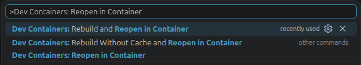
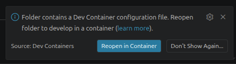
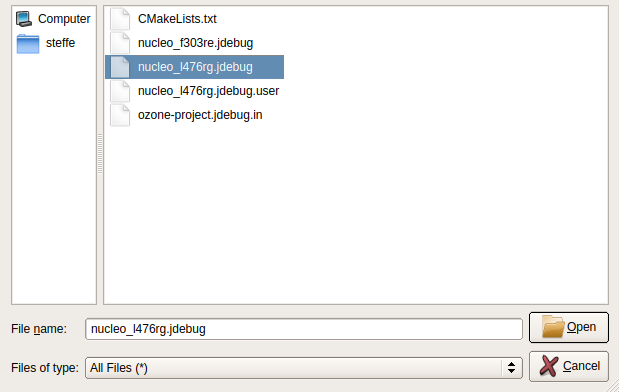

# PWM Fan Controller

PWM fan controller based on Zephyr 4.4.0

## Repository Layout

- `.devcontainer/`: reproducible containerized development environment
- `.vscode/`: workspace-specific VS Code settings and tasks
- `app/`: host-side application code
- `docs/`: project documentation and images
- `firmware/`: Zephyr firmware project and west manifest (`firmware/west.yml`)
- `firmware/debug/`: SEGGER Ozone project template (`ozone-project.jdebug.in`) and generated `.jdebug` files

## Recommended Workflow

Use the dev container on both Linux and Windows for a consistent toolchain and SEGGER Ozone for flashing / debugging.

### Prerequisites

1. Docker: 
   - Linux: Docker Engine with user added to `docker` group.
   - Windows: Linux `WSL` virtual machine (ex. `Ubuntu`) and Docker Desktop with `WSL` support enabled 
2. VS Code.
3. VS Code extension: Dev Containers.
4. SEGGER Ozone and SEGGER J-Link software installed on host.
5. J-Link debugger or ST-Link debugger reflashed with J-Link firmware ([ST-Link reflash tutorial](https://www.segger.com/products/debug-probes/j-link/models/other-j-links/st-link-on-board/))

###  Environment Setup

1. Clone repository. 
- `NOTE`: On Windows you need to clone repository in WSL Linux virtual machine instead of Windows file system for better performance:
   - Open your WSL virtual machine  (ex. `Ubuntu`) 
   - Clone the repo in the WSL file system (ex. `/home/user`) not in the Windows file system
2. In VS Code open the cloned repository
3. Press `CTRL +  SHIFT + P` and search `Dev Containers: Reopen in Container`

   
   
   or you can use the pop-up  in  the lower right corner
   
   

4. The environment will begin setting up it might take a couple minutes on first build

### Building and Flashing

1. Press `CTRL + SHIFT + B` and select you target board
2. Once the application is built open ozone on host
3. Go to `File` -> `Open`
4. Go to your cloned repository and select Ozone file for your target board from path `PWM-fan-controller/firmware/debug`

   

5. Now you can flash and debug you application via Ozone